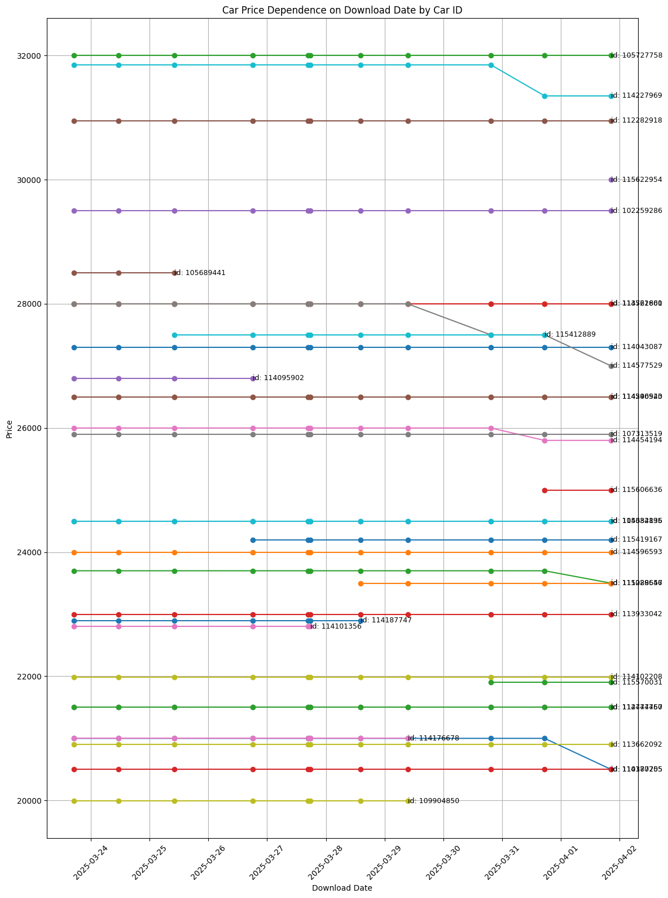
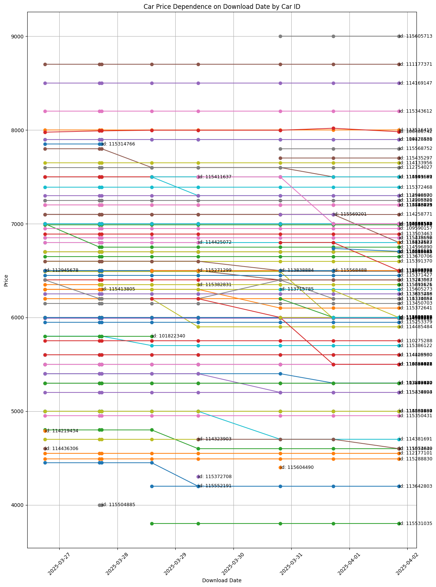

# car-insider
Accumulates a car market offers and visualizing price and other metrics history. Hypothesys is this can provide some insights for me as a buyer.

## download.sh
Downloads actual offers from `api.av.by` for
 * BMW F34. Consist of 2 pages, so we make 2 api calls.

and accumulates results in `history`.

It extends each offer (`advert` in `av.by` api naming) with current datetime, so we can track metrics by datetime later.

## view.sh
Extract metrics we are interested in from raw `history` data into `view.csv`. It can be pasted to Excel to draw plots.

## generate html from insights.ipynb
```bash
jupyter nbconvert insights.ipynb --no-input --no-prompt --to html
```

## insights.ipynb
### BMW F34

```
2025-03-29T09:25:02+0300 -> 2025-03-30T19:24:09+0300
	🆕: [115570031]
	❌: [109904850, 114176678]
	📉: {114577529: -500}
2025-03-30T19:24:09+0300 -> 2025-03-31T17:19:26+0300
	🆕: [115606636]
	📉: {114227969: -500, 114454194: -200}
2025-03-31T17:19:26+0300 -> 2025-04-01T20:29:35+0300
	🆕: [115622954]
	❌: [115412889]
	📉: {110387255: -500, 115288557: -200, 114577529: -500}
```

### AUDI A4 B6

```
2025-03-29T09:25:02+0300 -> 2025-03-30T19:24:09+0300
	🆕: [115435297, 115604196, 115604007, 115568488, 115604490, 115568752, 115569201, 115605713, 115604919, 115605273, 115568893]
	❌: [115271299, 115372708, 114323903, 115382831, 114425072, 115411637, 115552191]
	📈: {114334387: 200}
	📉: {115283537: -100, 115372641: -200, 115288287: -100, 114381691: -299, 115529621: -200, 115434994: -200}
2025-03-30T19:24:09+0300 -> 2025-03-31T17:19:26+0300
	🆕: [115613937, 115426397, 113698135]
	❌: [113715785, 115604490, 113838884]
	📈: {106406742: 21}
	📉: {114199687: -100, 114334387: -200, 115604196: -200, 115554532: -500, 114585416: -500, 115529621: -500, 113267170: -100}
2025-03-31T17:19:26+0300 -> 2025-04-01T20:29:35+0300
	🆕: [115612171, 113720829, 115614527]
	❌: [115568488, 115569201]
	📉: {115604007: -300, 115613937: -291, 115132663: -300, 115554630: -100, 106406742: -37, 113698135: -31}
```
